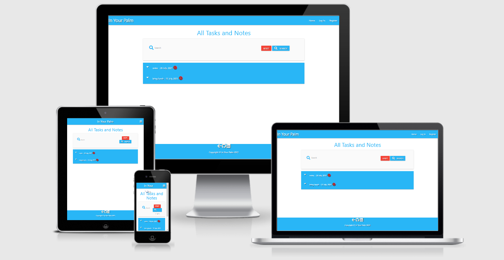

# In Your Palm

In Your Palm is a website to write notes, tasks even a schedule as you need it.
In this website it is based off the backend for the data but also allows users too add to it.

# Index

1. [UX](#ux)
2. [Features](#features)
3. [Technologies Used](#technologies-used)
4. [Testing](#testing)
5. [Deployment](#deployment)
6. [Credits](#credits)

## UX

This website is a notepad that lets people create, delete and edit what they have typed in the website. 

### User Stories

- As a first time user, I want to find out what this website is about and also what it offers.
- As a first time user, I want to be able to easily navigate to through the website adding, editing and deleting tasks, lists and anything i need to write down.
- As a first time user, I want to have easy and smooth setup and just a simple website to take notes etc.
- As a returning user, I want to easily access my notes, tasks, lists i saved.
- As a regular user, I want to get straight to writting down what i want saved quick and easy.

## Wireframes 

- The wireframes are of the website on a android phone, desktop and ipad.

## Features

Each page features consistent design via use of colours to facilitate an intuitive and comfortable user experience. 
This website has a number of pages which include Home, Log in, log out, register, manage categories and new note. which are all linked to the nav bar.

1. Home page with the name of the site, a search bar to search notes, also a dropdown list of all tasks in site.
2. Profile page is the users own page with there name used on sign up and a button to add a note.
3. New note page where users can enter the details of what they want stored.
4. Manage categories page where categories can be added, edited and also deleted
5. Login page with a form for logging in.
6. Logout page with form to logout of website.
7. Register page where users can register to the site.
8. The footer has a '<' to return to Home and a github and linkedln linked to my own pages.
 

### Features Left to Implement

- Add a fully functional profile page where users can add image to ther profile and have all notes they wrote on there page.

- A calculator added to the site if users want to do shopping bills etc.

- Add styling for notes like different text, colours, highlighters and option to pin note on the device.

## Technologies Used

- [HTML5](https://html.com)
- [CSS3](https://www.w3.org/TR/2001/WD-css3-roadmap-20010523/)
- [JavaScript](https://javascript.com)
- [Python](https://www.python.org/)
- [Jinja](https://jinja.palletsprojects.com/en/2.11.x/)

#### Libraries

- [Flask](https://pypi.org/project/Flask/)

- [Materialize](materializecss.com/)

- [Jquery](https://jquery.com/)

#### Tools and Platform

- [Git](https://git-scm.com/)
- [GitHub](https://github.com/)
- [MongoDB](https://www.mongodb.com/)
- [Heroku](https://www.heroku.com/)

## Testing

### Validation

- [W3C](https://validator.w3.org/)   HTML validator
- [W3C](https://jigsaw.w3.org/css-validator/)   CSS validator
- [Jshint](https://jshint.com/) Javascript validator
- [Pep8](https://pypi.org/project/pep8/) Python

### User Testing

-  Attemped to login with incorrect details - error message displays
-  Register on the website - displays correct information
-  Tested adding, editing and deleting notes - successfully working
-  Tested blank information on pages - all error messages show

## Deployment

This site uses MongoDB and the data storage and Heroku as hosting site.

#### Connecting to MongoDB

`mongo "mongodb<url connection string>" ` 

- On your mongoDB project page click on databases in the deployment tab.
- Click connect button on the cluster and connect using 'connect your application'
- Select driver and version and copy the connection string from here and add it to the app.py file.

#### Create Collection

In MongoDB CLI type:

 `db.<collection>.insert(<document>)`
 
#### Adding Index
 
 In MongoDB CLI type:
 
 `db.<collection>.createIndex({<fields>:<type>}{<options>})`
 

### Platform

This site is deployed to Heroku: 
 https://todo-app-ms3.herokuapp.com/

#### Create Heroku App

- On your dashboard in heroku click on the 'new button' top right side.
- Once clicked dropdown will open click on ' create new app' 
- Enter app name and region and click create app

Setting Enviroment variables

- In heroku dashboard:
 - Select app you just made and go to settings
 - Go down until you see Config Vars click 'reveal config vars'
 - Add enviroment variables in the key value pairs 
 - Click 'Add' to add each key

Deployment

 - Create the required files in the repository
 
   - requirements.txt
    - To create ` pip3 freeze > requirements.txt ` in the root directory
  
   - Procfile 
    - To create  `echo web: python3 app.py > Procfile` in the root directory

In heroku dashboard

 - Select App
 - Select Deploy from the menu
 - Connect app to github
 - Select User
 - Add repo name and search
 - Click Connect

## Credits

Structure and content based heavily on:

  - [Code Institute Solutions - README Template](https://github.com/Code-Institute-Solutions/readme-template)
  - Mini project 
    - [Code Institute](https://learn.codeinstitute.net/courses/course-v1:CodeInstitute+DCP101+2017_T3/courseware/9e2f12f5584e48acb3c29e9b0d7cc4fe/054c3813e82e4195b5a4d8cd8a99ebaa/) - heavily based on this project.
    
  - [W3 Schools](https://www.w3schools.com/) various resources
  - [youtube](https://youtu.be/xjHEcmjlD-Y) Pretty Printed - ideas and code 
  - [youtube](https://youtu.be/yKHJsLUENl0) Python Engineer - ideas and code 

### Acknowledgements

* [W3 Schools](https://www.w3schools.com/)  Various resources
* [GitHub](https://github.com/March-Hackathon-Team-27/Hackathon-Project-canRename-)  README template
* [Code institute](https://learn.codeinstitute.net/courses/course-v1:CodeInstitute+DCP101+2017_T3/courseware/9e2f12f5584e48acb3c29e9b0d7cc4fe/054c3813e82e4195b5a4d8cd8a99ebaa/) 
